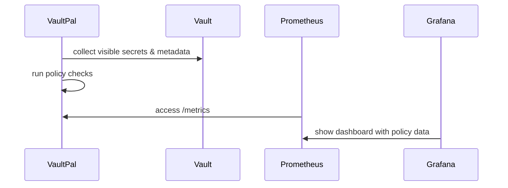

# VaultPal

Connects to a Vault instance and collects metadata for secrets that it is allowed to see.

Requires:
* java11 or higher

## Development Setup

Running a test vault instance 
```shell
docker run -d --name vault -p 8200:8200 -e 'VAULT_DEV_ROOT_TOKEN_ID=myroot' hashicorp/vault:1.19
docker exec  -ti vault /bin/ash
```

Running the binary:
```shell
./mvnw clean package
# via token file
VAULT_TOKEN_FILE=/Users/philipp/vault_token java -jar target/vaultpal-1.0-SNAPSHOT.jar
# via token env variable
VAULT_TOKEN=myroot java -jar target/vaultpal-1.0-SNAPSHOT.jar
```

