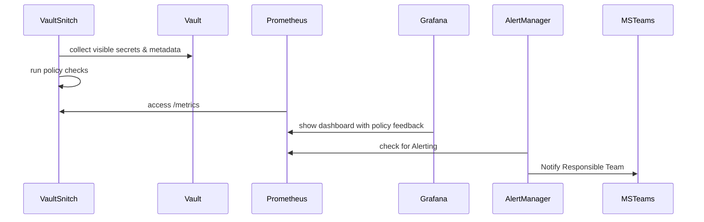

# VaultSnitch

Connects to a Vault instance and collects metadata for secrets that it is allowed to see.


```mermaid
sequenceDiagram
    VaultSnitch->>Vault: collect visible secrets & metadata
    VaultSnitch->>VaultSnitch: run policy checks
    Prometheus->>VaultSnitch: access /metrics
    Grafana->>Prometheus: show dashboard with policy feedback
    AlertManager->>Prometheus: check for Alerting
    AlertManager->>MSTeams: Notify Responsible Team
```

Requires:
* java11 or higher

## Metrics

All metrics are tagged with `store` (KV mount name), `path` (secret path within the store), and `vault_url` (address of the Vault instance being monitored).

---

### `vaultsnitch_secret_age_days`

Age of each secret in days, measured from the time the current version was last written (= last rotated). Use this to alert on secrets that haven't been rotated within your policy window.

**Example AlertManager rules:**

```yaml
- alert: SecretRotationOverdue
  expr: vaultsnitch_secret_age_days > 90
  labels:
    severity: warning
  annotations:
    summary: "Secret not rotated in > 90 days"
    description: "{{ $labels.store }}{{ $labels.path }} on {{ $labels.vault_url }}"

- alert: SecretRotationCritical
  expr: vaultsnitch_secret_age_days > 180
  labels:
    severity: critical
  annotations:
    summary: "Secret critically overdue for rotation"
    description: "{{ $labels.store }}{{ $labels.path }} on {{ $labels.vault_url }}"
```

---

### `vaultsnitch_secret_version`

Current version number of each secret. Use this in Grafana to confirm that rotation actually happened — the version number increases with every write.

---

## Open Topics

- **CI: run `verify` in a container** — the GitHub Action currently runs `mvn -B clean verify package` directly on the runner, which means it needs Docker available for TestContainers. Switch to a container-based job (e.g. `services: docker` or a DinD sidecar) so integration tests run reliably in CI without depending on the runner's Docker setup.
- **Distribute as a container image** — add a `Dockerfile` and a GitHub Actions workflow that builds the fat JAR, packages it into a container image, and pushes it to GitHub Container Registry (ghcr.io) on every merge to `main`.
- **Parallel deployment / scoped instances** — currently a single instance sees all secrets the token permits. Explore splitting responsibility across multiple instances (e.g. by store name or path prefix) so teams can run their own scoped deployments without exposing each other's data. Needs design work: how instances are scoped (allowlist of stores? path prefix filter?), whether metrics stay comparable across instances, and how to avoid double-counting in shared dashboards.

## Development Setup

Running a test vault instance:
```shell
docker run -d --name vault -p 8200:8200 -e 'VAULT_DEV_ROOT_TOKEN_ID=myroot' hashicorp/vault:1.19
docker exec  -ti vault /bin/ash
```

Running the binary:
```shell
./mvnw clean package
# via token file
VAULT_TOKEN_FILE=/Users/philipp/vault_token java -jar target/vaultsnitch-1.0-SNAPSHOT.jar
# via token env variable
VAULT_TOKEN=myroot java -jar target/vaultsnitch-1.0-SNAPSHOT.jar
```
