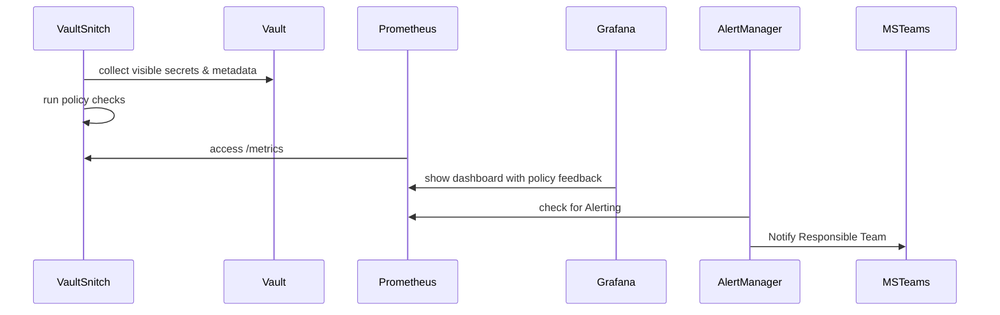

# VaultSnitch

Connects to a Vault instance and collects metadata for secrets that it is allowed to see.


```mermaid
sequenceDiagram
    VaultSnitch->>Vault: collect visible secrets & metadata
    VaultSnitch->>VaultSnitch: run policy checks
    Prometheus->>VaultSnitch: access /metrics
    Grafana->>Prometheus: show dashboard with policy feedback
    AlertManager->>Prometheus: check for Alerting
    AlertManager->>MSTeams: Notify Responsible Team
```

Requires:
* java11 or higher

## Metrics

### Common tags

All per-secret metrics carry the following labels:

| Tag | Description |
|-----|-------------|
| `store` | KV v2 mount point name (e.g. `secret`, `database`) |
| `path` | Secret path within the store (e.g. `/prod/db`) |
| `vault_url` | Address of the monitored Vault instance (`VAULT_URL` env var) |
| `team` | Value of the `team` field from [KV v2 custom metadata](#team-tag); `"unknown"` if unset |

### Team tag

VaultSnitch reads the `team` field from [KV v2 custom metadata](https://developer.hashicorp.com/vault/docs/secrets/kv/kv-v2#custom-metadata) and exposes it as a `team` label on all per-secret metrics. Secrets without this field are tagged `team="unknown"`.

Set it when creating or updating a secret:
```shell
vault kv metadata put -custom-metadata team=payments secret/prod/db
```

With the `team` tag in place, per-team rollups are standard PromQL — no dedicated rollup metrics needed:
```promql
# Secrets per team
count by (team) (vaultsnitch_secret_age_days)

# Stale secrets per team (older than 90 days)
count by (team) (vaultsnitch_secret_age_days > 90)

# Complexity violations per team
sum by (team) (vaultsnitch_complexity_violation)
```

---

### `vaultsnitch_secrets_total`

Total number of secrets discovered across all stores. No tags.

---

### `vaultsnitch_stores_total`

Total number of KV v2 mount points accessible. No tags.

---

### `vaultsnitch_secret_age_days`

Tags: `store`, `path`, `vault_url`, `team` — see [Common tags](#common-tags).

Age of each secret in days, measured from the time the current version was last written (= last rotated). Use this to alert on secrets that haven't been rotated within your policy window.

**Example AlertManager rules:**

```yaml
- alert: SecretRotationOverdue
  expr: vaultsnitch_secret_age_days > 90
  labels:
    severity: warning
  annotations:
    summary: "Secret not rotated in > 90 days"
    description: "{{ $labels.store }}{{ $labels.path }} on {{ $labels.vault_url }}"

- alert: SecretRotationCritical
  expr: vaultsnitch_secret_age_days > 180
  labels:
    severity: critical
  annotations:
    summary: "Secret critically overdue for rotation"
    description: "{{ $labels.store }}{{ $labels.path }} on {{ $labels.vault_url }}"
```

---

### `vaultsnitch_secret_version`

Tags: `store`, `path`, `vault_url`, `team` — see [Common tags](#common-tags).

Current version number of each secret. Use this in Grafana to confirm that rotation actually happened — the version number increases with every write.

---

### `vaultsnitch_secret_never_rotated`

Tags: `store`, `path`, `vault_url`, `team` — see [Common tags](#common-tags).

`1` if the secret is still at version 1 (never been rotated since creation), `0` otherwise. Different from age: a recently created secret at v1 is expected, but a six-month-old secret at v1 is a policy gap. Combine with `vaultsnitch_secret_age_days` for precise alerting:

```yaml
- alert: OldSecretNeverRotated
  expr: vaultsnitch_secret_never_rotated == 1 and vaultsnitch_secret_age_days > 30
  labels:
    severity: warning
  annotations:
    summary: "Secret has never been rotated"
    description: "{{ $labels.team }} — {{ $labels.store }}{{ $labels.path }} on {{ $labels.vault_url }}"
```

---

### `vaultsnitch_complexity_violation`

Tags: `store`, `path`, `vault_url`, `team` — see [Common tags](#common-tags).

`1` if the secret's `password` field fails the configured complexity pattern, `0` if it passes. Secrets without a `password` field are not evaluated.

**Example AlertManager rule:**

```yaml
- alert: ComplexityViolationDetected
  expr: vaultsnitch_complexity_violation == 1
  labels:
    severity: warning
  annotations:
    summary: "Password does not meet complexity requirements"
    description: "{{ $labels.team }} — {{ $labels.store }}{{ $labels.path }} on {{ $labels.vault_url }}"
```

---

### `vaultsnitch_secret_expires_in_days`

Tags: `store`, `path`, `vault_url`, `team` — see [Common tags](#common-tags).

Number of days until the secret expires, based on the `expires_at_date` field in [KV v2 custom metadata](https://developer.hashicorp.com/vault/docs/secrets/kv/kv-v2#custom-metadata). Positive values mean the secret is still valid, negative values mean it has already expired, zero means it expires today. Secrets without `expires_at_date` emit no metric (opt-in).

Set the expiry date:
```shell
vault kv metadata put -custom-metadata=expires_at_date=2025-12-31 secret/prod/db
```

**Example AlertManager rules:**

```yaml
- alert: SecretExpiringsoon
  expr: vaultsnitch_secret_expires_in_days < 30 and vaultsnitch_secret_expires_in_days >= 0
  labels:
    severity: warning
  annotations:
    summary: "Secret expires within 30 days"
    description: "{{ $labels.team }} — {{ $labels.store }}{{ $labels.path }} on {{ $labels.vault_url }}"

- alert: SecretExpired
  expr: vaultsnitch_secret_expires_in_days < 0
  labels:
    severity: critical
  annotations:
    summary: "Secret has expired"
    description: "{{ $labels.team }} — {{ $labels.store }}{{ $labels.path }} on {{ $labels.vault_url }}"
```

---

## Open Topics

- **Distribute as a container image** — add a `Dockerfile` and a GitHub Actions workflow that builds the fat JAR, packages it into a container image, and pushes it to GitHub Container Registry (ghcr.io) on every merge to `main`.
- **Parallel deployment / scoped instances** — currently a single instance sees all secrets the token permits. Explore splitting responsibility across multiple instances (e.g. by store name or path prefix) so teams can run their own scoped deployments without exposing each other's data. Needs design work: how instances are scoped (allowlist of stores? path prefix filter?), whether metrics stay comparable across instances, and how to avoid double-counting in shared dashboards.

## Development Setup

Running a test vault instance:
```shell
docker run -d --name vault -p 8200:8200 -e 'VAULT_DEV_ROOT_TOKEN_ID=myroot' hashicorp/vault:1.19
docker exec  -ti vault /bin/ash
```

Running the binary:
```shell
./mvnw clean package
# via token file
VAULT_TOKEN_FILE=/Users/philipp/vault_token java -jar target/vaultsnitch-1.0-SNAPSHOT.jar
# via token env variable
VAULT_TOKEN=myroot java -jar target/vaultsnitch-1.0-SNAPSHOT.jar
```

### Using Podman instead of Docker

Export `DOCKER_HOST` so Testcontainers can find Podman's socket, then use `podman` in place of `docker`:

```shell
export DOCKER_HOST=$(podman machine inspect --format 'unix://{{.ConnectionInfo.PodmanSocket.Path}}')
```

(Podman Desktop sets this automatically — check `echo $DOCKER_HOST` first. If it already points to a Podman socket, no action is needed.)

Start Vault and run tests as usual:
```shell
podman run -d --name vault -p 8200:8200 -e 'VAULT_DEV_ROOT_TOKEN_ID=myroot' hashicorp/vault:1.19
./mvnw clean verify
```
